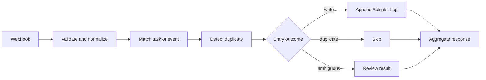

# Log Actuals

## Workflow card

| Item | Value |
|---|---|
| Purpose | Record completed, partial, missed, or cancelled work so planning can compare estimates with actual execution. |
| Trigger | Webhook action `log_actuals`; production path redacted. |
| Terminal outcomes | `written`, `duplicate_skipped`, `ambiguous_match`, validation error, failed/degraded dependency. |
| Reads | Request entries; `Tasks`; `Generated_Calendar_Events`; existing `Actuals_Log` rows for duplicate detection. |
| Writes | `Actuals_Log`. |
| Source of truth | `Actuals_Log` for completed and attempted work. |
| Side effects | Appends one row per accepted nonduplicate entry. |
| Idempotency | Entry-level `idempotency_key`; repeated keys must not create duplicate rows. |
| Credentials | `automateos_database`. |
| Artifacts | spec: complete; manifest: complete; export: missing; code: missing; fixtures: missing. |

## Architecture

`Webhook → Validate entries → Match task/event → Detect duplicate → [Append Actuals_Log | Skip duplicate | Return ambiguous] → Aggregate response`

The control-flow roles are grounded in documented production behavior. Exact node names, node types, parameters, looping strategy, and connections require the sanitized active n8n export.

## Contract

Canonical contract: [`docs/architecture/api-contracts.md#action-log_actuals--production`](../../architecture/api-contracts.md).

### Request

| Field | Type | Req | Default | Meaning / validation |
|---|---|---:|---|---|
| `action` | string | yes | — | Must equal `log_actuals`. |
| `entries` | object[] | yes | — | Nonempty array. |
| `api_version` | string | new producers | `1.0` compatibility | Contract version. |
| `request_id` | string | new producers | generated compatibility value | Invocation identity. |
| `idempotency_key` | string | mutation requests | generated compatibility behavior | Request-level replay identity. |
| `source` | string | new producers | compatibility behavior | Initiating surface. |
| `requested_at` | datetime | new producers | compatibility behavior | Request timestamp. |
| `timezone` | string | no | `America/Chicago` when needed | Local time interpretation. |

### Entry fields

| Field | Type | Req | Meaning / validation |
|---|---|---:|---|
| `task` | string | yes | Human-readable activity. |
| `status` | string | yes | Common values: `completed`, `partial`, `missed`, `cancelled`. Partial must remain partial. |
| `timestamp` | datetime | no | Execution timestamp. |
| `date` | date | no | Execution date. |
| `source` | string | no | Entry source when different from request source. |
| `context` | string | no | Work context. |
| `energy` | string/number | no | Energy state. |
| `project` | string | no | Parent project. |
| `task_category` | string | no | Category. |
| `planned_quantity` | number | no | Planned amount; zero is valid. |
| `planned_unit` | string | no | Planned unit. |
| `actual_quantity` | number | no | Completed amount; zero is valid. |
| `actual_unit` | string | no | Actual unit. |
| `duration_minutes` | number | no | Actual duration; zero is valid. |
| `barrier` | string | no | Reason for delay or noncompletion. |
| `next_action` | string | no | Follow-up or remaining work. |
| `notes` | string | no | Additional context. |
| `task_id` | string | no | Stable task identity. |
| `generated_event_uid` | string | no | Stable n8n-generated Calendar identity. |
| `google_event_id` | string | no | Google Calendar identity. |
| `idempotency_key` | string | strongly recommended | Entry-level duplicate-prevention identity. |

### Response

| Field | Type | Always | Meaning |
|---|---|---:|---|
| `ok` | boolean | Version 1 envelope | Whether unresolved failure remains. |
| `status` | string | Version 1 envelope | `completed`, `partial`, `degraded`, or `failed` as applicable. |
| `result.received` | number | success/partial | Entries received. |
| `result.written` | number | success/partial | Rows appended. |
| `result.duplicates_skipped` | number | success/partial | Replays not written. |
| `result.ambiguous_matches` | number | success/partial | Entries not silently attached. |
| `result.rows` | object[] | success/partial | Per-entry outcomes and matched IDs. |
| `warnings` | array | Version 1 envelope | Nonfatal concerns. |
| `error` | object/null | Version 1 envelope | Structured unresolved failure. |

## Node map

| ID | Exact n8n node name | Type | Reads | Produces / side effect | Next |
|---|---|---|---|---|---|
| N01 | Exact name pending export | Webhook | HTTP request | Raw request | N02 |
| N02 | Exact name pending export | Unknown | Raw request | Validated normalized entries | N03 |
| N03 | Exact name pending export | Unknown | Entries, `Tasks`, `Generated_Calendar_Events` | Reliable match or ambiguous result | N04 / N08 |
| N04 | Exact name pending export | Unknown | Entry key and `Actuals_Log` | Duplicate result | N05 |
| N05 | Exact name pending export | IF/Switch/Code unknown | Match and duplicate result | Entry route | N06 / N07 / N08 |
| N06 | Exact name pending export | Google Sheets append | Accepted entry | `Actuals_Log` row | N09 |
| N07 | Exact name pending export | Unknown | Duplicate entry | Skipped result | N09 |
| N08 | Exact name pending export | Unknown | Ambiguous entry | Review result | N09 |
| N09 | Exact name pending export | Respond to Webhook / aggregation unknown | Per-entry results | Summary response | — |

## Branch matrix

| Branch | Deterministic condition | Output | Mutation |
|---|---|---|---|
| B01 | Request invalid, `entries` empty, or entry lacks `task`/`status` | validation error | None. |
| B02 | Entry idempotency key already exists | `duplicate_skipped` | None. |
| B03 | Reliable task/event identity or safe match; not duplicate | `written` | Append one `Actuals_Log` row. |
| B04 | Candidate match is uncertain | `ambiguous_match` | None; return for review. |
| B05 | Sheet read/write or another required dependency fails | failed/degraded | No false success; exact partial-failure state requires export verification. |

## Data and side effects

| Order | Operation | System | Record / identifier | Failure behavior |
|---:|---|---|---|---|
| 1 | Validate and normalize | n8n | request and entry IDs | Invalid entries must not mutate Sheets. |
| 2 | Resolve task/event identity | Google Sheets | `task_id`, `generated_event_uid`, `google_event_id` | Uncertain matches remain unattached and are surfaced. |
| 3 | Detect replay | `Actuals_Log` | entry `idempotency_key` | Existing key skips duplicate write. |
| 4 | Append accepted actual | Google Sheets | `Actuals_Log` row | Failure must surface; do not claim completion. |
| 5 | Aggregate outcomes | n8n | request ID | Return counts and per-entry status. |

Historical Calendar events are not silently rewritten. Actuals describe execution; Calendar remains the source of truth for scheduled time.

## Code map

| Node | File | Mode | Integrity | Purpose |
|---|---|---|---|---|
| Production Code nodes | Not captured | Unknown | Missing | Exact active source must be exported from n8n. |

The repository and discovered Notion records describe behavior but do not preserve the exact production Code-node source. No implementation code has been reconstructed or invented in this pack.

## Reliability

| Concern | Rule |
|---|---|
| Validation | Request requires `action=log_actuals` and a nonempty entries array; every entry requires `task` and `status`. |
| Zero values | Numeric zero must be preserved rather than converted to null or omitted. |
| Partial work | Must remain `partial`; never coerce to completed or missed. |
| Matching | Use stable task/event IDs when available; uncertain matches return for review. |
| Idempotency | Repeated entry key must not append another row. Exact implementation requires export/code capture. |
| Retry | Not documented. |
| Timeout | Not documented. |
| Partial failure | Multi-entry batch behavior after some successful appends is not fully documented and requires export/code verification. |
| Audit | `Actuals_Log` row plus preserved raw payload context. |
| Recovery | Safe replay depends on stable entry keys; exact repair process is not yet captured. |

## Validation and health

| Test ID | Scenario | Expected outcome | Required side effect |
|---|---|---|---|
| T01 | One valid completed entry | `written` | One `Actuals_Log` row. |
| T02 | Partial UWorld entry | `written`, status remains `partial` | One row with actual/planned values. |
| T03 | Zero actual quantity or duration | `written` | Stored zero remains numeric zero. |
| T04 | Replayed entry key | `duplicate_skipped` | No extra row. |
| T05 | Ambiguous task/event match | `ambiguous_match` | No silently attached row. |
| T06 | Invalid request | validation error | No row. |
| T07 | Sheet write failure | failed/degraded | No false completion response. |
| T08 | Multi-entry batch with mixed outcomes | correct aggregate counts | Only accepted nonduplicate entries written. |

Production behavior is documented for structured records, zero preservation, partial completion, and original payload context. Machine-readable fixtures, exact execution evidence, and paths T04–T08 remain to be captured.

## Operations

- Activation: production according to project state; exact active flag requires n8n inspection/export.
- Trigger: webhook; production URL and authentication material remain redacted.
- Dependencies: n8n; AutomateOS Database; stable task/event identifiers; Sheets availability.
- Import: sanitized `workflow.n8n.json` is missing; this pack is not yet sufficient to reproduce the active graph exactly.
- Known limitation: exact nodes, code, retry behavior, batch semantics, and partial-failure handling are not preserved.
- Next planned change: capture the active sanitized export, extract exact Code-node source, and add fixtures before modifying workflow behavior.

## Artifact status

| Artifact | Status | Path / note |
|---|---|---|
| Compact spec | complete | `spec.md` |
| Manifest | complete | `manifest.yaml` |
| Sanitized export | missing | `workflow.n8n.json` |
| Exact Code-node source | missing | `code/` |
| Fixtures | missing | `fixtures/` |
