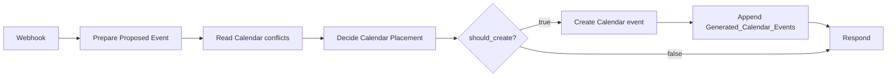

# Place Calendar Event Safely

## Workflow card

| Item | Value |
|---|---|
| Purpose | Single write gate for AutomateOS-created Google Calendar events. |
| Trigger | Webhook action `place_calendar_event_safely`; production path redacted. |
| Terminal outcomes | `create`, `create_stacked`, `create_and_flag_existing_for_reschedule`, `needs_reschedule_new_event`, `needs_review`, validation error, dependency failure |
| Reads | Webhook payload; Google Calendar conflicts; embedded `AUTOMATEOS_METADATA_JSON`. |
| Writes | Google Calendar; `Generated_Calendar_Events`. |
| Source of truth | `Generated_Calendar_Events` for n8n-created-event identity and audit; Google Calendar for user-visible schedule. |
| Side effects | Creates an event only when `should_create == true`; appends generated-event audit after creation. |
| Idempotency | Stable `generated_event_uid` plus timing and metadata equivalence; equivalent requests must not create duplicates. |
| Credentials | `google_calendar_primary`; `automateos_database`. |
| Artifacts | spec: complete; manifest: complete; export: missing; code: complete; fixtures: partial. |

## Architecture

`Webhook → Prepare Proposed Event → Read Calendar window → Decide placement → [Create Event → Append audit | No-write response]`

Exact non-Code node names and connection parameters require the sanitized n8n export. The preserved roles above are grounded in the canonical implementation record.

## Contract

Canonical contract: [`docs/architecture/api-contracts.md`](../../architecture/api-contracts.md).

### Inputs

| Field | Type | Req | Default | Meaning / validation |
|---|---|---:|---|---|
| `action` | string | yes | — | Must equal `place_calendar_event_safely`. |
| `start_datetime` | datetime | yes | — | Proposed start; invalid or missing values fail. |
| `end_datetime` | datetime | yes | — | Proposed end; invalid or missing values fail. |
| `generated_event_uid` | string | no | `event_<timestamp>` | Stable internal event identity. |
| `source_assignment_id` | string | no | `manual_event` | Upstream assignment or request identity. |
| `title` | string | no | `AutomateOS Event` | User-visible Calendar title. |
| `timezone` | string | no | `America/Chicago` | Event timezone. |
| `description` | string | no | generated UID description | User-visible portion of description. |
| `category` | string | no | `uncategorized` | Conflict and stackability category. |
| `movability` | string | no | `flexible` | Fixed, semi-fixed, flexible, or other preserved value. |
| `eisenhower` | string | no | `Q2` | Priority quadrant metadata. |
| `priority_score` | number | no | `50` | Numeric priority; zero is preserved. |
| `stackability` | string | no | `none` | Overlap behavior. |
| `attention_requirement` | string | no | `unknown` | Attention metadata. |
| `location_requirement` | string | no | `unknown` | Location metadata. |
| `can_overlap_categories` | string[] | no | `[]` | Explicit compatible categories. |
| `cannot_overlap_categories` | string[] | no | `[]` | Explicit incompatible categories. |
| `requires_review_if_overlap` | boolean | no | `false` | Preserved metadata; current decision Code does not independently branch on it. |

### Outputs

| Field | Type | Always | Meaning |
|---|---|---:|---|
| `generated_event_uid` | string | yes after validation | Stable internal identity. |
| `should_create` | boolean | yes after decision | Controls the downstream mutation branch. |
| `decision` | string | yes after decision | Terminal placement outcome. |
| `audit_status` | string | yes after decision | `passed`, `passed_with_warning`, or `blocked`. |
| `created_status` | string | yes after decision | Creation-state summary. |
| `reason` | string | yes after decision | Human-readable deterministic rationale. |
| `conflict_count` | number | yes after decision | Actual overlapping normalized events. |
| `compatible_conflicts` | object[] | yes after decision | Stackable overlaps. |
| `incompatible_conflicts` | object[] | yes after decision | Blocking overlaps. |
| `google_event_id` | string | mutation branch | Created event identity; exact response placement requires export verification. |

## Node map

| ID | Exact n8n node name | Type | Reads | Produces / side effect | Next |
|---|---|---|---|---|---|
| N01 | Exact name pending export | Webhook | HTTP request | Raw request | N02 |
| N02 | `Prepare Proposed Event` | Code | Request body | Validated event, metadata, `calendar_description` | N03 |
| N03 | Exact name pending export | Google Calendar read | Proposed window | Candidate events | N04 |
| N04 | `Decide Calendar Placement` | Code | Prepared event and candidate events | Decision and conflict sets | N05 |
| N05 | Exact name pending export | IF | `should_create` | Create or no-write path | N06 / N08 |
| N06 | Exact name pending export | Google Calendar create | Approved event | Calendar event and Google ID | N07 |
| N07 | Exact name pending export | Google Sheets append | Decision and Google ID | Audit row in `Generated_Calendar_Events` | N08 |
| N08 | Exact name pending export | Respond to Webhook | Terminal result | API response | — |

## Branch matrix

| Branch | Deterministic condition | Output | Mutation |
|---|---|---|---|
| B01 | No actual overlapping event | `create` | Create Calendar event; append audit. |
| B02 | Overlaps exist and every overlap is compatible | `create_stacked` | Create Calendar event; append audit. |
| B03 | Incompatible overlaps exist; proposed is `fixed`; every incompatible existing event has movability `flexible`, `high`, or `semi_fixed` | `create_and_flag_existing_for_reschedule` | Create Calendar event; append audit. Preserved code does not evidence a separate reschedule write. |
| B04 | Incompatible overlaps exist and proposed movability is `flexible` | `needs_reschedule_new_event` | None. |
| B05 | Incompatible overlaps exist and no earlier branch matches | `needs_review` | None. |
| B06 | Wrong action or missing start/end | Validation error | None. |
| B07 | Calendar read, create, or audit dependency fails | Dependency failure / degraded execution | Must surface; exact configured n8n error path requires export. |

## Data and side effects

| Order | Operation | System | Record / identifier | Failure behavior |
|---:|---|---|---|---|
| 1 | Normalize request and serialize metadata | n8n | `generated_event_uid` | Validation throws before external mutation. |
| 2 | Read candidate events | Google Calendar | Google event IDs | Failure must not create an event. |
| 3 | Parse metadata and decide | n8n | `AUTOMATEOS_METADATA_JSON` | Invalid metadata becomes low-confidence manual event; invalid dates conservatively overlap. |
| 4 | Create approved event | Google Calendar | `google_event_id` | Creation failure must surface. |
| 5 | Append audit | Google Sheets | `Generated_Calendar_Events` row | Logging failure is degraded; creation is not fully complete until mapping is recorded. |

The Calendar Create Event node must use `calendar_description`, not plain `description`, or structured metadata is lost.

## Code map

| Node | File | Mode | Integrity | Purpose |
|---|---|---|---|---|
| `Prepare Proposed Event` | [`code/prepare-proposed-event.js`](code/prepare-proposed-event.js) | Exact mode pending export | Git blob `485b779093ba798365c870602392dd3801a683df` | Validate, normalize, generate UID, and serialize metadata. |
| `Decide Calendar Placement` | [`code/decide-calendar-placement.js`](code/decide-calendar-placement.js) | Exact mode pending export | Git blob `52096b94489e30baf85968fa79b91fca6c43c7b6` | Parse events, classify overlap, and return deterministic decision. |

## Reliability

| Concern | Rule |
|---|---|
| Validation | Action and start/end are mandatory. |
| Duplicate prevention | Uses stable identity, timing, and metadata rather than title alone. |
| Unknown metadata | Manual events become `unknown_manual_event` with low confidence. |
| Invalid dates | Conservatively treated as overlapping. |
| Idempotency | Equivalent requests must not create a second event. Exact configured n8n replay implementation requires export verification. |
| Retry | Not documented in preserved implementation record. |
| Timeout | Not documented. |
| Partial failure | Calendar creation followed by audit failure creates a degraded state requiring reconciliation. |
| Audit | Created Google event ID and decision must be recorded in `Generated_Calendar_Events`. |
| Recovery | Reconcile from `Generated_Calendar_Events` and Google event IDs; do not search by title alone. |

## Validation and health

| Test ID | Scenario | Expected outcome | Required side effect |
|---|---|---|---|
| T01 | Open slot | `create` | One Calendar event and one audit row. |
| T02 | Repeated or conflicting UWorld placement | `needs_reschedule_new_event` | No new event. |
| T03 | Travel in open slot | `create` | Travel event and audit row. |
| T04 | Podcast during travel | `create_stacked` | Podcast event and audit row. |
| T05 | UWorld during travel | blocked via `needs_reschedule_new_event` or `needs_review`, according to proposed movability | No new event. |
| T06 | Metadata round trip | metadata parse succeeds | Created event retains `AUTOMATEOS_METADATA_JSON`. |
| T07 | Audit write failure after Calendar create | degraded | Created event is detectable for reconciliation; no false success. |

T01–T06 are documented as manually behavior-tested. Machine-readable fixtures and an export-grounded T07 path remain incomplete.

## Operations

- Activation: production-tested; exact active flag requires export or n8n inspection.
- Trigger: webhook; production URL and secrets remain redacted.
- Dependencies: n8n, Google Calendar, Google Sheets, credential health, Calendar metadata preservation.
- Import: sanitized `workflow.n8n.json` is currently missing; manual reconstruction from this spec is not yet considered equivalent.
- Known limitation: current movable-event list contains literal `high`, which may be unintended but is preserved exactly.
- Known limitation: stackability is asymmetric in some branches and permissive when either side allows the category.
- Next planned change: safe Calendar deletion using persisted `google_event_id` and ledger status updates.

## Artifact status

| Artifact | Status | Path / note |
|---|---|---|
| Compact spec | complete | `spec.md` |
| Manifest | complete | `manifest.yaml` |
| Sanitized export | missing | `workflow.n8n.json` |
| Exact Code-node source | complete | `code/*.js` |
| Fixtures | partial | Validation evidence documented; JSON fixtures not yet captured. |
