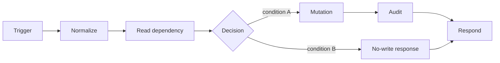

# Workflow name

## Workflow card

| Item | Value |
|---|---|
| Purpose | One sentence. |
| Trigger | Type and sanitized path or schedule. |
| Terminal outcomes | `outcome_a`, `outcome_b` |
| Reads | Systems and tables. |
| Writes | Systems and tables. |
| Source of truth | Canonical record after execution. |
| Side effects | External mutations. |
| Idempotency | Key and replay behavior. |
| Credentials | Logical aliases only. |
| Artifacts | spec: complete; manifest: complete; export: missing; code: not_applicable; fixtures: partial |

## Architecture

`Trigger → Normalize → Read → Decide → [Branch A | Branch B] → Audit → Respond`

## Contract

Canonical contract: `docs/architecture/api-contracts.md#replace-me`

### Inputs

| Field | Type | Req | Default | Meaning / validation |
|---|---|---:|---|---|
| `action` | string | yes | — | Must equal `replace_me`. |

### Outputs

| Field | Type | Always | Meaning |
|---|---|---:|---|
| `ok` | boolean | yes | Whether the request completed as represented. |
| `outcome` | string | yes | Terminal branch identifier. |

## Node map

| ID | Exact n8n node name | Type | Reads | Produces / side effect | Next |
|---|---|---|---|---|---|
| N01 | Webhook | Webhook | HTTP request | Raw payload | N02 |
| N02 | Normalize Request | Code | Raw payload | Validated request | N03 |

## Branch matrix

| Branch | Condition | Nodes executed | Output | Mutation |
|---|---|---|---|---|
| B01 | Deterministic condition | N05, N07, N08 | `outcome_a` | Describe exact writes. |
| B02 | Otherwise | N06, N08 | `outcome_b` | None. |

## Data and side effects

| Order | Operation | System | Record / identifier | Failure behavior |
|---:|---|---|---|---|
| 1 | Read | system | record | Fail or degrade explicitly. |
| 2 | Write | system | stable identifier | Describe retry and partial failure. |
| 3 | Audit | system | request ID | Required before success response. |

## Code map

| Node | File | Mode | SHA-256 | Purpose |
|---|---|---|---|---|
| Normalize Request | `code/normalize-request.js` | Run once for all items | `capture-after-export` | Validate and normalize request. |

## Reliability

| Concern | Rule |
|---|---|
| Validation | Describe required fields and malformed-input result. |
| Idempotency | Describe key and replay result. |
| Retry | State which calls retry and which do not. |
| Timeout | State timeout or `not documented`. |
| Partial failure | Describe state after each mutation can fail. |
| Audit | Define required audit record. |
| Recovery | Define safe replay or repair path. |

## Validation and health

| Test ID | Scenario | Expected terminal outcome | Required side effect |
|---|---|---|---|
| T01 | Normal success | `outcome_a` | Expected mutation and audit. |
| T02 | Invalid input | validation error | No mutation. |
| T03 | Idempotent replay | prior result or duplicate outcome | No duplicate mutation. |

Health check: link to fixture or recorded validation run.

## Operations

- Activation: active / inactive / unknown.
- Trigger: sanitized path, schedule, or upstream workflow.
- Credentials: logical aliases only.
- Dependencies: required systems and health conditions.
- Import: use sanitized `workflow.n8n.json`; restore credentials manually.
- Known limitations: concise list.
- Next planned change: one item.

## Artifact status

| Artifact | Status | Path / note |
|---|---|---|
| Compact spec | complete | `spec.md` |
| Manifest | complete | `manifest.yaml` |
| Sanitized export | missing | `workflow.n8n.json` |
| Exact Code-node source | not_applicable | `code/` |
| Fixtures | partial | `fixtures/` |
